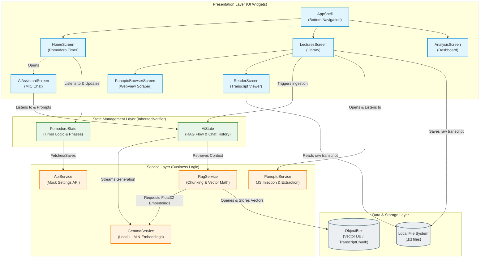

# Entrepreneurship | Group N: Coursework 2

This repository contains the final submission assets for **Coursework 2**. It includes our pitch materials, technical documentation, and legal frameworks developed throughout the module.

---

## Submission Deliverables

| Asset | Source / Link |
| :--- | :--- |
| **Pitch Deck** | [Link to Presentation](https://docs.google.com/presentation/d/12Wf0biEPcASuq50PFNK5GeybYlofFMy-/edit?usp=sharing&ouid=102049752064715129815&rtpof=true&sd=true) |
| **Demo Video** | TODO SAM |
| **Terms of Service:** | [Link](TODO_BRIAN)
| **Ethics & Legal Documentation:** | [Link](TODO_BRIAN)
| **Visual Artefacts** | [View Artefacts](./posters) |

---

## Technical Documentation

### Final Product
The core mobile application developed for this project:
**Repository:** [MIC-Notes Mobile](https://github.com/MIC-Notes/mic-mobile)
**Architecture Diagram:**
  

